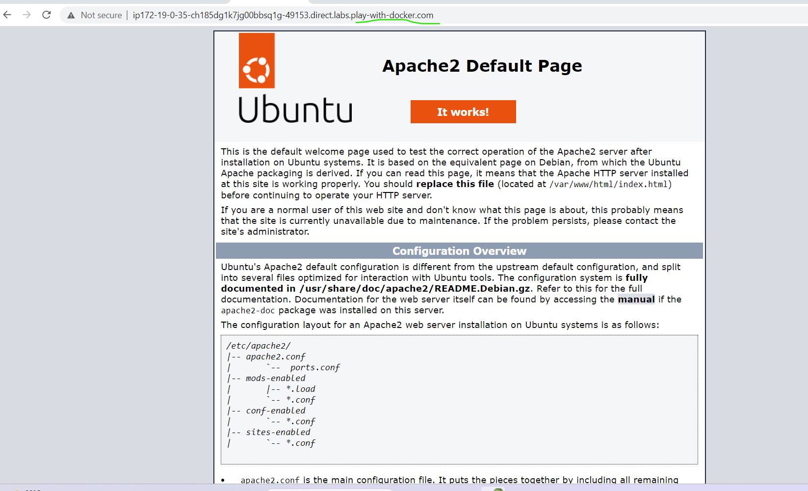

# 1.create an alpine container in interactive mode and install python

```
docker container run -it --name alpine alpine:3

or

docker container run -it alpine /bin/sh

apk update 
apk add python3
apk python3 --version

or
apk add --update --no-cache python3

```


# 2.create an ubuntu container with sleep 1d and login using exec. Install python

```
docker container run -d --name mycontainer ubuntu sleep 1d
docker container exec -it mycontainer /bin/bash
apt-get update
apt-get install -y python3
python3 --version

```


# 3. create a postgres container with user ponoramic  and password as trekking.Try logging in and show the databases (query for the psql)

```
docker container run -d --name postgrescont -v postgresvol:/var/lib/postgres -P -e POSTGRES_DATABASE=employees -e POSTGRES_USER=panoramic -e POSTGRES_PASS WORD=trekking postgres:13
```
* for entry in the container

```
docker container exec -it postgrescont /bin/bash

psql -U panoramic

```

* To create database in it
```
CREATE DATABASE testdb;
OR
archana=# CREATE TABLE my_table (
    client_id character varying(36) NOT NULL,
    value character varying(255)
);

or

CREATE DATABASE test;
\c test
CREATE TABLE test_table(something int);
INSERT INTO test_table VALUES (123);
SELECT * FROM test_table;

\q

```

* Insert the values

```
insert into my_table values (1 ,'aaa');
insert into my_table values (2 ,'bbb');

select * from my_table;  
```


# 4.Creating a dockerfile which runs phpinfo page , user ARG and ENV wherever appropriate.Try on apache server and Try on nginx server

* manual commands
 ```
 sudo apt-get update
 sudo apt install apache2 -y
 sudo apt install nginx -y
 sudo apt install php8.1-fpm -y
 sudo systemctl status nginx
 sudo systemctl status apache2
 sudo systemctl status php8.1-fpm
 sudo systemctl restart nginx
 sudo chmod -R 777 /var/www/html
 echo ?php phpinfo(); /var/www/html/info.php

 ```
## dockerfile for php
```
FROM ubuntu:22.04
LABEL author="archana" org="qt"
ARG DEBIAN_FRONTEND=noninteractive
RUN apt update && \
    apt install vim -y && \
    apt install apache2 -y && \
    apt install php -y && \
    apt install libapache2-mod-php -y
WORKDIR /var/www/html
COPY /info.php /var/www/html/info.php
EXPOSE 80
CMD [ "apache2ctl","-D","FOREGROUND" ]
```
* Execute this commands for build image
 
  $ docker image build -t apache:v1.0.0 .

* for creating container(phpcont is container name)

  docker container run -d -P --name phpcont apache:v1.0.0

  docker container ls -a
* Execute this commands after with use of that port number in dockerplayground type thae port number the apache page came after /info.php type after that link then php page opened.  
 
 
 
   

* Dockerfile 
```
FROM ubuntu:22.04
LABEL author="archana" 
ENV DEBIAN_FRONTEND noninteractive
RUN apt-get update
RUN apt-get install nginx -y && \
    rm -rf /var/lib/apt/lists/*
COPY default.conf /etc/nginx/sites-available/default    
RUN nginx -t
RUN chmod -R 777 /var/www/html
RUN echo "<?php phpinfo(); >?" /var/www/html/info.php
RUN service php8.1-fpm restart
ENTRYPOINT ["/bin/bash","-c", "service php8.1-fpm start && nginx -g 'daemon off;'"]
EXPOSE 80
```
* after goto dockerplayground connect instance and run this commands
  
```
docker image build -t nginx .
docker container run --name php -d -P nginx
docker container ls
docker container run --name php -d -p 3000:8080 nginx
docker ecec -it php /bin/bash

```

goto dockerplayground after execute above commands click on openport execute the poer number newtab opened in that link /info.php add so php page came

# 5.create a jenkins image by creating your own Dockerfile

* First goto dockerplayground
* then create vi dockerfile
* In that copy the jenkins dockerfile
* [Referhere](https://get.jenkins.io/)
* jenkins debian packages(search in google) with reference of this we can install the jenkins. 

------------

FROM ubuntu:22.04
LABEL author=archana
RUN apt-get update && apt-get install curl openjdk-11-jdk maven -y
RUN curl fsSL https://pkg.jenkins.io/debian-stable/jenkins.io-2023.key | tee \
    /usr/share/keyrings/jenkins-keyring.asc > /dev/null
RUN echo deb [signed-by=/usr/share/keyrings/jenkins-keyring.asc] \
    https://pkg.jenkins.io/debian-stable binary/ | tee \
    /etc/apt/sources.list.d/jenkins.list > /dev/null
RUN apt-get update && apt-get install jenkins -y
EXPOSE 8080
CMD ["/usr/bin/jenkins"]    

------------
next execute this commands

```
docker image build -t jenkins .
docker image ls
docker container run -it --name jenkinscont jenkins
docker container ps -a                              # for check the running containers 
docker container run --name jenkinscont -d -p 3000:8080 jenkins      # in this jenkinscont is container name ,jenkins is image name

```

next goto dockerplayground openport enter the port number then open the jenkins page in new tab


# 6.create nop commerce and mysql server containers and try to make them work
them by configuring
```Dockerfile
FROM ubuntu:22.04 as unzip
RUN mkdir /Nop
RUN apt update &amp;&amp; \
    apt install wget unzip -y &amp;&amp; \
    cd /Nop &amp;&amp; \
    wget
&quot;https://github.com/nopSolutions/nopCommerce/releases/download/release-
4.50.3/nopCommerce_4.50.3_NoSource_linux_x64.zip&quot; &amp;&amp;\
    unzip /Nop/nopCommerce_4.50.3_NoSource_linux_x64.zip &amp;&amp; \
    rm /Nop/nopCommerce_4.50.3_NoSource_linux_x64.zip

FROM mcr.microsoft.com/dotnet/aspnet:6.0
LABEL author=&quot;Asee&quot;
COPY  --from=unzip /Nop /Nop
WORKDIR /Nop
EXPOSE 80
CMD [&quot;dotnet&quot;,&quot;/Nop/Nop.Web.dll&quot;]

```

* goto dockerplayground run this commands

```
docker image build -t nop:1.0.0.0 .
docker image ls
docker container run --name nop -d -P nop:1.0.0.0
docker container ps -a
docker container rm -f $(docker container ls -aq)

```
* First we can bulid the image image name is nop 
* Next create a container after that we can check the container is running stage or exited if exited then remove the container and again create the container.
* Next in that port number came ,we can type that port number in dockerplayground openport the newtab opened(if not opened try again) and nop page came.
 


