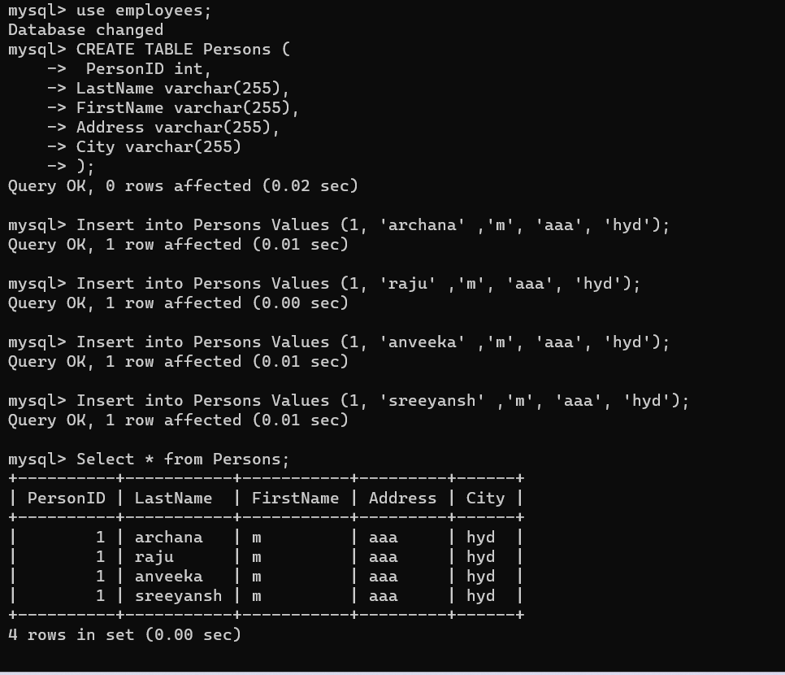

# Docker Activity Day3(16apr2023)
write dockerfile for stateful applications like MySql, PostgreSql and NoSql etc..
-----------------------------------------------------------------------------------
* got to docker play ground=>Add new instance=>run this below command
* Google=>mysql docker image 
 
* To pull the image  from the docker registry
```
docker pull mysql:8
```
* to see the list of docker images 
```
docker image ls
```
* to create the volume
```
docker volume create <volume name>

docker volume create mysql   =>(mysql is my volume name)
```
* To create a docker container and create database and create mysql user,password,volume
* To create a volume in mysql container and it is for mount that to other container
```
docker container run -d --name mysql -v mysql:/var/lib/mysql -P -e MYSQL_ROOT_PASSWORD=password -e MYSQL_DATABASE=employees -e MYSQL_USER=archana -e MYSQL_PASSWORD=password mysql
```
* For executing the docker container
```
docker container exec -it mysql mysql --password=password   ##password is my password it's our own we can set any password
```
mysql> use employees;
Database changed
mysql> CREATE TABLE Persons (
    ->  PersonID int,
    -> LastName varchar(255),
    -> FirstName varchar(255),
    -> Address varchar(255),
    -> City varchar(255)
    -> );

mysql> Insert into Persons Values (1, 'archana' ,'m', 'aaa', 'hyd');
Query OK, 1 row affected (0.01 sec)

mysql> Insert into Persons Values (1, 'raju' ,'m', 'aaa', 'hyd');
Query OK, 1 row affected (0.00 sec)

mysql> Insert into Persons Values (1, 'anveeka' ,'m', 'aaa', 'hyd');
Query OK, 1 row affected (0.01 sec)

mysql> Insert into Persons Values (1, 'sreeyansh' ,'m', 'aaa', 'hyd');
Query OK, 1 row affected (0.01 sec)

mysql> Select * from Persons;
+----------+-----------+-----------+---------+------+
| PersonID | LastName  | FirstName | Address | City |
+----------+-----------+-----------+---------+------+
|        1 | archana   | m         | aaa     | hyd  |
|        1 | raju      | m         | aaa     | hyd  |
|        1 | anveeka   | m         | aaa     | hyd  |
|        1 | sreeyansh | m         | aaa     | hyd  |
+----------+-----------+-----------+---------+------+
4 rows in set (0.00 sec)

mysql> exit
Bye

* Now i'm delete the container

  $ docker container rm -f $(docker container ls -aq)

* now to check persisted volume 
 
  $ docker volume ls

* Now creating new one with mounting old volume to it

$ docker container run -d --name mysqldb --mount "source=mysql,target=/var/lib/mysql,type=volume" -P -e MYSQL_ROOT_PASSWORD=password -e MYSQL_DATABASE=employees -e MYSQL_USER=archana -e MYSQL_PASSWORD=password mysql
975e61dc726a5ffce08e43454433cd59e2f5996c84aa74b913f85790a2f11159

  $ docker container exec -it mysqldb mysql --password=password

* after we can execute that command open mysql in that we can type use employees;
* next  Select * from Persons;
* then that table opened means that table is copied from first container volume we deleted that container but that table in volumes.so it's copied to container2(mysqldb---it is my second container name)
* volumes like be replicas

mysql> use employees;  ## employees is my database name ###
Reading table information for completion of table and column names
You can turn off this feature to get a quicker startup with -A

Database changed
mysql> Select * from Persons;   ### persons is we can give any name ###
+----------+-----------+-----------+---------+------+
| PersonID | LastName  | FirstName | Address | City |
+----------+-----------+-----------+---------+------+
|        1 | archana   | m         | aaa     | hyd  |
|        1 | raju      | m         | aaa     | hyd  |
|        1 | anveeka   | m         | aaa     | hyd  |
|        1 | sreeyansh | m         | aaa     | hyd  |
+----------+-----------+-----------+---------+------+
4 rows in set (0.00 sec)

mysql> exit


