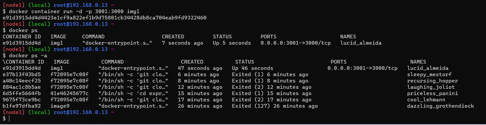
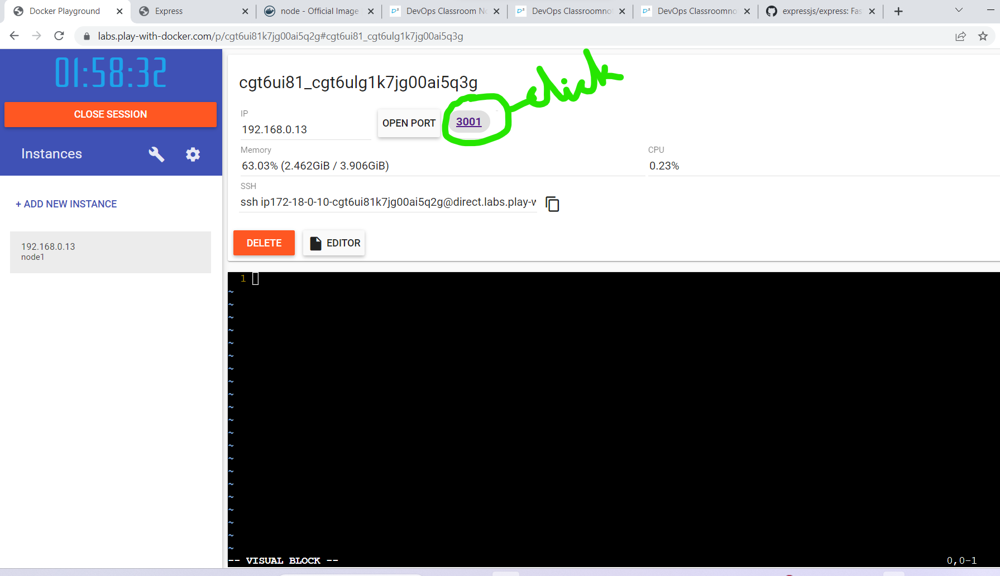
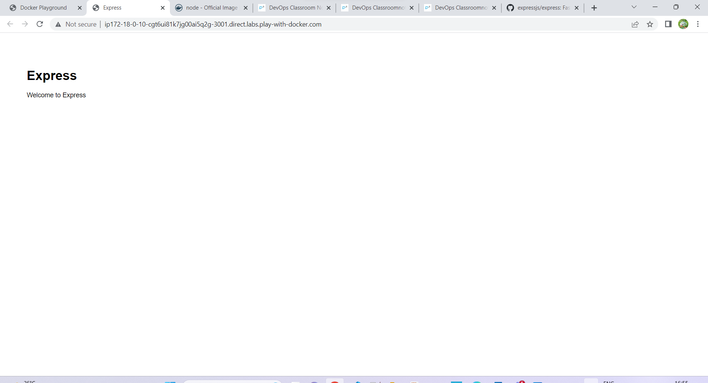

## Docker activity day2(15apr2023)
-------------------------

# write a Dockerfile for nodejs application

# prerequisites

clone this  https://github.com/expressjs/express
Nodejs <= 0.10
Npm
git

steps in Dockerfile
1. FROM (base image)   ubuntu or nodejs  
2. need to add prerequests (Run command)
3. clone repo
4. cd express
5. npm install express
6. npm install -g express-generator@4
7. express /tmp/foo && cd /tmp/foo
8. npm install
9. Expose 3000
10. workdir /tmp/foo
11. npm start (CMD ['npm', 'start'])

( enetry point ==> which will execute first when container start)

## Answer
goto docker playground

vi dockerfile 
```
FROM node
LABEL author=archana
LABEL organization=qt
RUN git clone https://github.com/expressjs/express && \
    cd express && \
    npm install express && \
    npm install -g express-generator@4 && \
    express /tmp/foo && \
    cd /tmp/foo && npm install
EXPOSE 3000
WORKDIR /tmp/foo
CMD ["npm","start"]

```
next execute this command for image building
* docker image build -t img1 .   ## img1 is image name we can give any name
  next command 
* docker container run -d -p 3001:3000 img1
* docker container ps

    
* container id came then next goto docker playground
  
*  
  
*  

## For removing docker containers command is 

docker container rm -f $(docker container ls -a -q)

* for full screen in docker playground alt+enter


