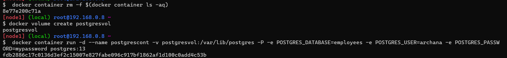

# Docker Activity Day3(16apr2023)
write dockerfile for stateful applications like MySql, PostgreSql and NoSql etc..
-----------------------------------------------------------------------------------
* got to docker play ground=>Add new instance=>run this below command
* Google=>postgresql docker image 

##
* To pull the image  from the docker registry
```
docker pull postgres:13
```
* If any containers is there first we can delete that containers so command is 
 
```
docker container rm -f $(docker container ls -aq)
```
* for deleting the image 
```
docker image rm -f b7b5848f21bf<image id or image name>
```
* To create a docker container 
```
docker container run -d --name postgrescont -v postgresvol:/var/lib/postgres -P -e POSTGRES_DATABASE=employees -e POSTGRES_USER=archana -e POSTGRES_PASSWORD=mypassword postgres:13
```

In this 1.is container name and 2 is volume name

In the above preview 1.is container name and 2 is volume name 3 is image name




* To login in to the container
```
docker container exec -it postgrescont /bin/bash

```


* If any error came first we can login intio the postgres with username,password 

* To login to the Postgresdb
```
psql -U <username>

psql -U archana
```

* To create database in it
```
CREATE DATABASE testdb;
OR
archana=# CREATE TABLE my_table (
    client_id character varying(36) NOT NULL,
    value character varying(255)
);

```


* Insert the values

```
insert into my_table values (1 ,'aaa');
insert into my_table values (2 ,'aaa');


select * from my_table;       =>my_table is my table name we can give any name
```


* In postgress to check the databases
```
\l
```
exit


### delete the container
```
docker container rm -f $(docker container ls -aq)


docker container run -d --name postgrescont --mount "source=postgresvol,target=/var/lib/postgres,type=volume" -P -e POSTGRES_DATABASE=employees -e POSTGRES_USER=archana -e POSTGRES_PASSWORD=mypassword postgres:13

```


* For checking the volume in the container

```
docker container exec -it postgrescont psql -U archana
```
use employees;

Select * from my_table2;

* If we want to check the volumes 
```
docker volume ls
```


