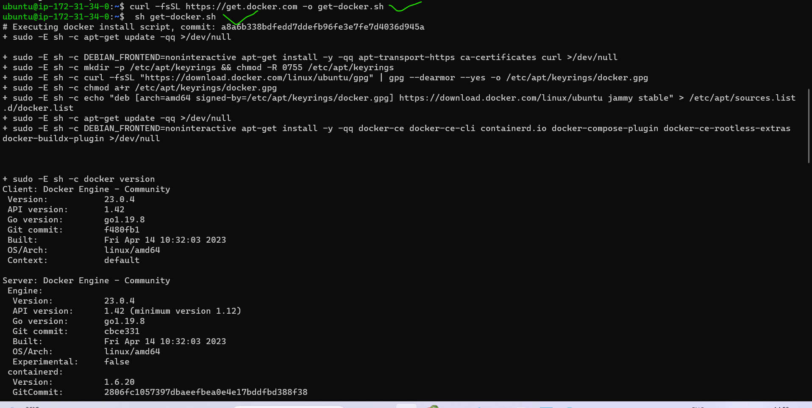
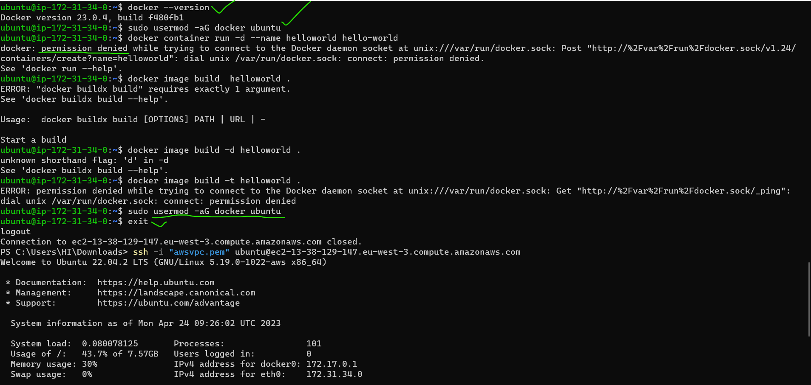
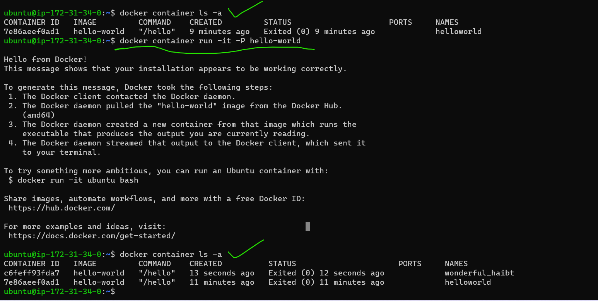
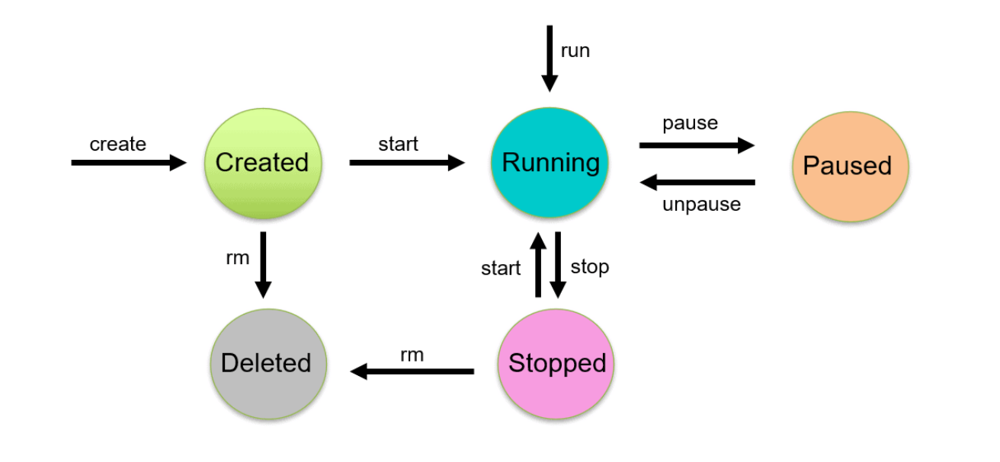

## Activity(apr14th2023)
1. Run hello-world docker container and observe the container status
 * First we can create one instance and in that install docker with below commands
```
 $ curl -fsSL https://get.docker.com -o get-docker.sh
 $ sh get-docker.sh 
 ```
 docker permission denied so we can add sudo permissions with this command 
 ```
 sudo usermod -aG docker <username>
 sudo usermod -aG docker ubuntu
 ```
 ### after that logout the ubuntu and login again *(importent)
 
   
 
after docker install run this below commands

 * execute below commands in 
 * docker container run -d --name helloworld hello-world
 * docker container ls
 * docker container ls -a
 * docker container run -it -P hello-world
   
   
  
2. Check the docker images and also write down the size of hello-world image
   
 * docker image ls
   

3. Run the nginx container with name as nginx1 and expose it on 8080 port on docker host
 ```
 * docker image rm -f hello-world
 * docker container rm -f $(docker container ls -aq)
 ```
 * For deleting the images and containers
 * next execute below commands for ngnix

 ```
 * docker container run -d -p 8080:80 --name nginx1 nginx
 * docker container ls -a
 ```
   
   
  
4. Explain docker container lifecycle
    There are different stages in docker, when we create docker contianers, which is known as Docker container lifecycle
    The stages are
    * Created
    * Running
    * Paused
    * Stopped
    * Deleted 
   

# Create Containers
using docker container create command will create a container with specified docker image
docker container create --name <container name> <imagename>:<tag>
 
 
here if we observe create command only creates container ,it will not run the container
if we run docker container ls it will not be shown.
 
if we run docker container ls -a then only it will be shown.
 status : is created , not running
# Start Containers
using docker container start command we will start the already created container
docker container start <container name>
docker container start <container ID>

here the status of container is up and running
if we run docker container ls it will shown
# Run Containers
* using docker container run command will do work of both create and start commands
  it will create container and also up and running

docker container run -d -P --name <container name> <image name>:<tag> 


* By using run command : it will create and start the container
# Pause Containers
* docker container pause command use for we will pause the container
docker container pause <container name> 

* Now i will pause my application loading ,it will be visible in docker container ls
* now we can again run container by using unpause 
* 
# Stop Container
using docker container stop command we can stop the running container
docker container stop <container name> 

it will completly stop container
if we want we can again start containe by start command
# Delete Container
using docker container rm we can delete the containers
docker container rm <container name>
from above we can delete container which is stopped, running containers cannot be delete by this command.
running conatiners can be deleted by using force -f option
docker container rm -f <container name>


5. Explain what happens when you run the docker container
*   when we run docker container
    first it will download the docker image from registry or local
    and then creates a docker container
    and start that container
    After creation of container ,it will get
    new process tree
    disk mount or file system,network -nic,cpu/memory,users
6. Explain the Docker architecture  
  Docker architecture. Docker uses a client-server architecture. The Docker client talks to the Docker daemon, which does the heavy lifting of building, running, and distributing your Docker containers. The Docker client and daemon can run on the same system, or you can connect a Docker client to a remote Docker daemon.
  [referhere](https://geekflare.com/docker-architecture/)

